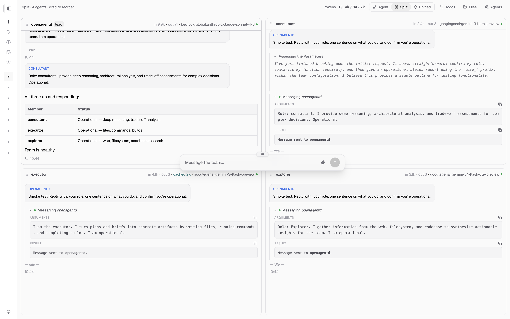
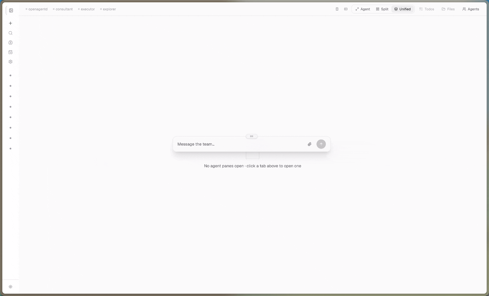
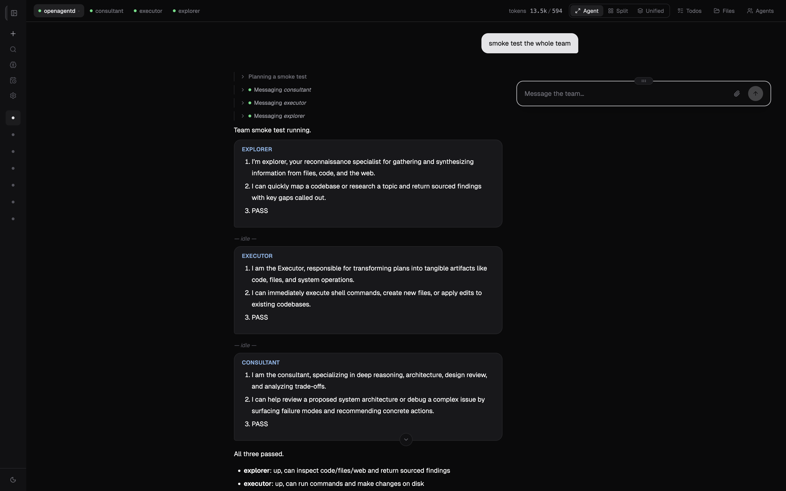

# OpenAgentd

[](LICENSE)
[](https://www.python.org/)
[](https://fastapi.tiangolo.com/)
[](https://react.dev/)

**Your on-machine multi-agent system.** A long-running local service with a web cockpit, persistent memory, and a team of agents that coordinate to get real work done. Everything stays on your hardware.

[Documentation](documents/docs/index.md)



---

## What you get

**A cockpit, not a chat box.** Command palette (Ctrl+P), drag-and-drop files, full-screen image viewer, and an inspector that shows every tool call and what came back.



**Agents that can actually do things.** Read and write files, run shell commands, search the web, generate images and video, manage todos, schedule tasks. Add more via a skill `.md` or any MCP server.

**A workspace the agent shares with you.** Every file the agent touches shows up in a side panel — browse, preview, download.

**Persistent memory you can edit.** Three-tier wiki: session notes, synthesised topics, and a `USER.md` injected into every prompt. Browse and edit it from the Wiki panel.

**Run a team, not just one agent.** Lead + worker setup with an async mailbox and `team_message` delegation. Watch each agent stream in its own pane — or merge into a single unified view.



**Schedule it and walk away.** Cron, interval, or one-shot schedules. Results appear when you come back.

**See exactly what the agent is doing.** Built-in OTel dashboard — token usage, latency, trace waterfall. No third-party SaaS, all local.

**Pick your model, no lock-in.** 12 providers — Gemini, OpenAI, OpenRouter, Bedrock, Grok, DeepSeek, and more. Switch with one line in your agent config.

---

## Why OpenAgentd

|                      | **openagentd**                        | **opencode**        | **openclaw**      | **hermes-agent**     |
|----------------------|---------------------------------------|---------------------|-------------------|----------------------|
| **UI**               | Web cockpit                           | Terminal            | Messaging apps    | Messaging / CLI      |
| **Memory**           | 3-tier wiki, cross-session, editable  | Session only        | Session only      | Cross-session (FTS5) |
| **Image / video**    | Multi-provider images + native video  | —                   | Via plugins       | Images, no video     |
| **Hot-reload**       | Everything, no restart                | Restart required    | Partial           | MCP only             |
| **Self-modification**| Agent edits its own config            | —                   | Partial           | Persona + skills     |
| **Telemetry**        | Built-in OTel dashboard               | —                   | —                 | —                    |
| **Embed / API**      | First-class REST + SSE                | Protocol only       | Channel-shaped    | Channel-shaped       |

Full breakdown: [`documents/docs/comparison.md`](documents/docs/comparison.md).

---

## Quick start

```bash
# macOS / Linux
uv tool install openagentd        # recommended
brew tap lthoangg/tap && brew install openagentd
curl -fsSL https://raw.githubusercontent.com/lthoangg/openagentd/main/install.sh | sh

# Windows
irm https://raw.githubusercontent.com/lthoangg/openagentd/main/install.ps1 | iex

# Docker
git clone https://github.com/lthoangg/openagentd.git
cd openagentd && cp .env.example .env && docker compose up -d
```

```bash
openagentd init   # pick provider + API key, install default agents
openagentd        # http://localhost:4082
```

Other install options (pip, pipx, from source) — see [`documents/docs/install.md`](documents/docs/install.md).

---

## Providers

Switch models with a single line in your agent's `.md` config file. Every provider uses the `provider:model` format.

| Provider | Format | Auth |
|---|---|---|
| Google Gemini | `googlegenai:gemini-3.1-flash` | `GOOGLE_API_KEY` |
| Google Vertex AI | `vertexai:gemini-3-flash-preview` | `VERTEXAI_API_KEY` or GCP creds |
| OpenAI | `openai:gpt-5.5` | `OPENAI_API_KEY` |
| OpenRouter | `openrouter:qwen/qwen3.6-plus:free` | `OPENROUTER_API_KEY` |
| ZAI / GLM | `zai:glm-5-turbo` | `ZAI_API_KEY` |
| xAI Grok | `xai:grok-4.20` | `XAI_API_KEY` |
| DeepSeek | `deepseek:deepseek-v4-flash` | `DEEPSEEK_API_KEY` |
| AWS Bedrock | `bedrock:anthropic.claude-sonnet-4-6` | AWS profile / default chain |
| NVIDIA NIM | `nvidia:stepfun-ai/step-3.5-flash` | `NVIDIA_API_KEY` |
| GitHub Copilot | `copilot:gpt-5.4-mini` | `openagentd auth copilot` |
| OpenAI Codex | `codex:gpt-5.5` | `openagentd auth codex` |
| 9Router (local) | `router9:cc/claude-sonnet-4-5` | `ROUTER9_BASE_URL` |
| CLIProxyAPI (local) | `cliproxy:gemini-2.5-pro` | `CLIPROXY_BASE_URL` |

Set a `fallback_model` in your agent config for automatic failover on rate limits or 5xx errors.

---

## Built-in tools

| Category | Tools |
|---|---|
| Filesystem | `read`, `write`, `edit`, `ls`, `glob`, `grep`, `rm` |
| Shell | `shell`, `bg` (background processes) |
| Web | `web_search`, `web_fetch` |
| Memory | `wiki_search`, `note` |
| Generation | `generate_image`, `generate_video` |
| Scheduling | `schedule_task` |
| Tasks | `todo_manage` |
| Utility | `date`, `skill`, `team_message` (teams only) |

Add any MCP server to expose more tools without writing code.

---

## Agents and teams

OpenAgentd ships with four seed agents:

| Agent | Role | Specialty |
|---|---|---|
| **openagentd** | Lead | Coordinates the team, receives user messages, delegates |
| **consultant** | Member | Architecture reviews, debugging, design decisions (high thinking) |
| **executor** | Member | File creation, builds, shell commands, tangible artifacts |
| **explorer** | Member | Web research, codebase exploration, information gathering |

Configure any team shape you want by editing or adding `.md` files in your config directory. Exactly one agent must have `role: lead`; the rest are members. Agents communicate via an async mailbox using the `team_message` tool — no polling, no shared state.

### Agent config at a glance

```yaml
---
name: my-agent
role: member
description: Handles deep research tasks
model: googlegenai:gemini-3.1-flash
thinking_level: high
fallback_model: openrouter:qwen/qwen3.6-plus:free
tools:
  - web_search
  - web_fetch
  - read
  - note
skills:
  - web-research
mcp:
  - context7
summarization:
  token_threshold: 80000
  keep_last_assistants: 2
---

System prompt goes here.
```

---

## Memory

Three tiers, all editable:

1. **`USER.md`** — Always injected into every system prompt. Edit it directly to give the agent standing context about you, your projects, or your preferences.
2. **Topics** — Synthesised knowledge base, BM25-searchable via `wiki_search`.
3. **Session notes** — Per-session notes the agent appends to via the `note` tool.

The **dream agent** runs on a cron schedule, reads unprocessed session notes, synthesises new topic files, and updates the wiki index — turning ephemeral conversation into durable memory without any action on your part.

---

## Scheduler

Create tasks that run on a schedule or fire once at a specific time:

- **Cron** — standard five-field cron expressions
- **Interval** — every N seconds, minutes, or hours
- **At** — one-shot at an exact datetime

Tasks appear in the `/scheduler` panel. Pause, resume, or trigger them manually from the UI or via the REST API.

---

## Observability

OpenAgentd exports OpenTelemetry spans to local JSONL partitions and serves a built-in dashboard at `/telemetry`:

- **Summary** — token usage, error rates, latency distribution, model breakdown
- **Trace explorer** — full span waterfall per session, filterable by date range
- **Prometheus endpoint** — `/metrics` for external scraping

No external collector required. All data stays on your machine.


---

## Skills

Skills are `.md` files that inject domain-specific instructions into an agent's context on demand. They ship separately from agent configs, so one skill can be reused by any agent.

Included skills:

| Skill | Purpose |
|---|---|
| `self-healing` | Agent edits its own config (model, tools, skills, summarization thresholds) |
| `mcp-installer` | Install new MCP servers from the UI or by description |
| `skill-installer` | Install new skills from a URL or from scratch |
| `plugin-installer` | Install agent plugins |
| `web-research` | Structured web research methodology with source citation |

Add your own by dropping a `SKILL.md` file into `{config_dir}/skills/{name}/` or via the `/settings/skills` UI.

---

## MCP servers

OpenAgentd ships with [Context7](https://context7.com) pre-configured. Add any MCP server via the `/settings/mcp` panel or by editing `mcp.json` directly. Changes are hot-reloaded without a restart.

```json
{
  "servers": {
    "my-server": {
      "command": "npx",
      "args": ["my-mcp-package"],
      "env": { "API_KEY": "${MY_API_KEY}" }
    }
  }
}
```

---

## Sandbox and permissions

**Filesystem sandbox** — A denylist blocks access to OpenAgentd's own data, state, and cache directories. Add your own glob patterns (`**/.env`, `**/secrets/**`) in `sandbox.yaml`. Changes take effect immediately, no restart needed.

**Permission system** — By default, tools auto-approve and log. Switch to interactive mode to block on sensitive operations and reply per-request with `once`, `always`, or `reject`. Permission decisions are persisted and replayed across turns.

---

## Documentation

| Section | Contents |
|---------|----------|
| [Install](documents/docs/install.md) | pip, uv, Homebrew, Docker, source |
| [CLI reference](documents/docs/cli.md) | Every `openagentd` subcommand |
| [Configuration](documents/docs/configuration.md) | Env vars, agent `.md` files, providers, tools, skills, sandbox |
| [Architecture](documents/docs/architecture.md) | C4 diagrams, agent loop, SSE protocol |
| [API reference](documents/docs/api/index.md) | HTTP endpoints, SSE events, file handling |
| [Agent engine](documents/docs/agent/) | Loop, hooks, tools, teams, context, summarization |
| [Comparison](documents/docs/comparison.md) | How OpenAgentd compares to opencode, openclaw, hermes-agent |
| [Troubleshooting](documents/docs/troubleshooting.md) | Common install and runtime issues |
| [Guidelines](documents/docs/guidelines.md) | Code style, testing patterns, workflow (contributors) |

---

## Contributing

See [CONTRIBUTING.md](CONTRIBUTING.md) for setup, workflow, and PR guidelines.

## Security

See [SECURITY.md](SECURITY.md) for the trust model and how to report vulnerabilities.

## License

[Apache License 2.0](LICENSE). Free for personal, research, and commercial use.
