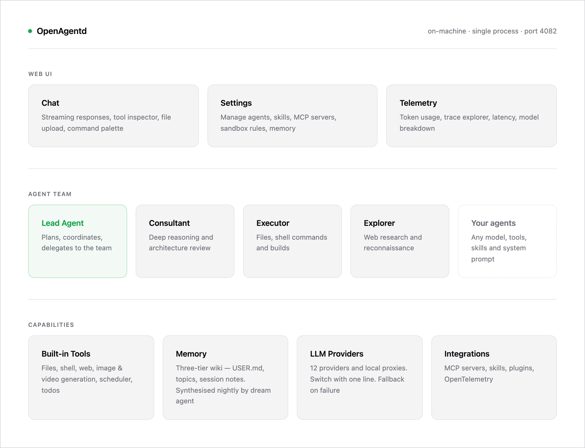

# OpenAgentd

[](LICENSE)
[](https://www.python.org/)
[](https://fastapi.tiangolo.com/)
[](https://react.dev/)

**Your on-machine multi-agent system.** A personal AI assistant OS that runs locally — chat, tools, persistent memory, teams of agents that coordinate, all on your machine.

[Documentation](documents/docs/index.md)


---

## What it is

OpenAgentd is a **personal AI assistant OS** — a long-running service on your machine where agents browse the web, read and write your files, run shell commands, remember things across sessions, and coordinate as a team to get real work done.

Think of it as the layer between you and your models: a workspace, a memory, a team of agents, and a UI to drive them — all under your control, all on your hardware.

Everything runs locally. Your data stays on your machine.



---

## What you get

**A cockpit, not a chat box.** Command palette (Ctrl+P), keyboard shortcuts, drag-and-drop images and documents, full-screen image viewer, and an inspector that shows every tool call the agent made and what came back. Built for both casual users and power users driving the system.


**Agents that can actually do things.** Read and edit your files, run shell commands, search and fetch the web, manage to-do lists, schedule tasks for later, and generate images and videos. Drop in a skill `.md` file or an MCP server to add more — no plugin system to learn.

**A workspace the agent shares with you.** Every file the agent reads, writes, or generates shows up in a side panel you can browse, preview, and download.

**Generate images and video on demand.** Built-in image generation (Gemini Imagen, OpenAI) and video generation (Google Gemini Video) — describe what you want, get it back inline, click for full-screen.

**Persistent memory you can edit.** The agent remembers across sessions via a three-tier wiki: notes written mid-session, topics synthesised by the dream agent, and a `USER.md` you can edit directly. Open the Wiki panel to browse, edit, or delete any of it.

**Run a team, not just one agent.** Lead + worker setup with an async mailbox between agents and a `team_message` tool the lead uses to delegate. The UI shows each agent in its own pane so you can watch them coordinate live — or merge them into a single unified stream.


**Schedule it and walk away.** Tell an agent to run a task daily, hourly, or at a specific time using cron, interval, or one-shot schedules. It runs in the background and shows results when you come back. Pair it with the built-in todo manager so the agent — or you — can track what's outstanding.

**See exactly what the agent is doing.** Built-in observability dashboard, backed by OpenTelemetry. Live traces, token usage, tool-call latency, model breakdowns — your own private telemetry, no third-party SaaS.

**Pick your model.** Gemini, Vertex AI, OpenAI, OpenRouter, ZAI, xAI Grok, DeepSeek, AWS Bedrock, NVIDIA NIM, GitHub Copilot, OpenAI Codex, and local proxies — switch with one env var. No lock-in.

**Build on top of it.** Everything the UI does is a documented HTTP + SSE API. Embed the bundled web UI, build your own, or drive it from a script.

---

## Why OpenAgentd

A few things that set OpenAgentd apart from other open-source self-hosted agents:

- **A real web cockpit, not a chat box.** Most self-hosted agents live in a terminal or in your messaging apps. OpenAgentd ships a polished web UI with a command palette, tool-call inspector, memory panel, scheduler, split-grid multi-agent view, and a built-in telemetry dashboard.
- **Multi-agent by design.** Lead + worker teams with an async inter-agent mailbox. The lead delegates via a `team_message` tool; each agent streams in its own pane so you can watch them coordinate live.
- **Hot-reload everything.** Drift detection at the end of every turn picks up changes to agent `.md` files, `mcp.json`, and skills without a restart. Includes a `self-healing` skill that lets the agent edit its own configuration.
- **12 providers, zero lock-in.** Gemini, Vertex AI, OpenAI, OpenRouter, ZAI/GLM, xAI Grok, DeepSeek, AWS Bedrock, NVIDIA NIM, GitHub Copilot, OpenAI Codex, and two local proxy adapters (9Router, CLIProxyAPI). Change one line in your agent config.
- **Extended reasoning built in.** Set `thinking_level: low | medium | high` per agent. Works across Claude, Gemini, and OpenAI reasoning models — token budget tracked separately.
- **Batteries included.** Filesystem, shell, web search/fetch, image generation, video generation, scheduler, todos, persistent editable memory, MCP server management, OpenTelemetry-backed `/telemetry` dashboard — shipped, no setup.
- **Build on top of it.** Everything the UI does is a documented REST + SSE API.

For a side-by-side comparison with [opencode](https://opencode.ai), [openclaw](https://openclaw.ai), and [hermes-agent](https://hermes-agent.nousresearch.com), see [`documents/docs/comparison.md`](documents/docs/comparison.md).

---

## Quick start

```bash
# macOS / Linux — pick one:
uv tool install openagentd        # recommended
brew tap lthoangg/tap && brew install openagentd
curl -fsSL https://raw.githubusercontent.com/lthoangg/openagentd/main/install.sh | sh

# Windows:
irm https://raw.githubusercontent.com/lthoangg/openagentd/main/install.ps1 | iex
```

```bash
openagentd init                   # first-time setup: provider, API key, config files
openagentd                        # API + web UI on http://localhost:4082
```

One process, one port. Open http://localhost:4082 in your browser.

---

## Getting started

### What `openagentd init` does

The wizard runs once (or whenever you want to change providers):

1. **Picks a provider** — choose from 12 LLM providers. Google Gemini and OpenRouter both have free tiers if you want to try without a paid key.
2. **Picks a model** — select from a curated list or type any model name.
3. **Handles credentials** — paste an API key (hidden input), or for OAuth providers (GitHub Copilot, OpenAI Codex) it tells you to run `openagentd auth <provider>` after setup.
4. **Installs your agent team** — copies default agent configs and skills into `~/.config/openagentd/`. Existing files are never overwritten, so re-running `init` is always safe.

### First steps in the UI

Once the app is running at http://localhost:4082:

| What | How |
|---|---|
| **Chat** | Type in the input at the bottom and press Enter. The default lead agent is ready. |
| **Command palette** | `Ctrl+P` / `Cmd+P` — search sessions, agents, files, and actions. |
| **Switch agents** | Click the agent name in the header to pick a different agent or start a team session. |
| **Workspace panel** | Every file the agent reads, writes, or generates appears in the left panel. Click to preview or download. |
| **Memory (Wiki)** | Open the Wiki panel to browse, edit, or delete anything the agent has remembered. Edit `USER.md` to give the agent standing context about you — it's injected into every system prompt. |
| **Telemetry** | Open `/telemetry` for token usage, latency, and trace explorer. |

### Customising your agent

Edit `~/.config/openagentd/agents/openagentd.md` to change the model, system prompt, tools, or skills. Changes are picked up at the end of the next turn — no restart needed.

```yaml
---
name: openagentd
model: googlegenai:gemini-3.1-flash   # change to any provider:model
thinking_level: medium
tools: [read, write, shell, web_search, note]
skills: [self-healing]
---

Your custom system prompt here.
```

See [Configuration](documents/docs/configuration.md) for the full reference.

---

## Install

**macOS / Linux — uv (recommended)**

```bash
uv tool install openagentd
```

**macOS / Linux — Homebrew**

```bash
brew tap lthoangg/tap
brew install openagentd
```

**Windows / alternative**

```bash
pipx install openagentd
```

**One-line installer (no uv or pipx required)**

```bash
curl -fsSL https://raw.githubusercontent.com/lthoangg/openagentd/main/install.sh | sh
```

```powershell
irm https://raw.githubusercontent.com/lthoangg/openagentd/main/install.ps1 | iex
```

**Docker**

```bash
git clone https://github.com/lthoangg/openagentd.git
cd openagentd && cp .env.example .env
docker compose up -d              # http://localhost:4082
```

Other options (pip, from source) — see [`documents/docs/install.md`](documents/docs/install.md).

---

## Providers

Switch models with a single line in your agent's `.md` config file. Every provider uses the `provider:model` format.

| Provider | Format | Auth |
|---|---|---|
| Google Gemini | `googlegenai:gemini-3.1-flash` | `GOOGLE_API_KEY` |
| Google Vertex AI | `vertexai:gemini-3-flash-preview` | `VERTEXAI_API_KEY` or GCP creds |
| OpenAI | `openai:gpt-5.5` | `OPENAI_API_KEY` |
| OpenRouter | `openrouter:qwen/qwen3.6-plus:free` | `OPENROUTER_API_KEY` |
| ZAI / GLM | `zai:glm-5-turbo` | `ZAI_API_KEY` |
| xAI Grok | `xai:grok-4.20` | `XAI_API_KEY` |
| DeepSeek | `deepseek:deepseek-v4-flash` | `DEEPSEEK_API_KEY` |
| AWS Bedrock | `bedrock:anthropic.claude-sonnet-4-6` | AWS profile / default chain |
| NVIDIA NIM | `nvidia:stepfun-ai/step-3.5-flash` | `NVIDIA_API_KEY` |
| GitHub Copilot | `copilot:gpt-5.4-mini` | `openagentd auth copilot` |
| OpenAI Codex | `codex:gpt-5.5` | `openagentd auth codex` |
| 9Router (local) | `router9:cc/claude-sonnet-4-5` | `ROUTER9_BASE_URL` |
| CLIProxyAPI (local) | `cliproxy:gemini-2.5-pro` | `CLIPROXY_BASE_URL` |

Set a `fallback_model` in your agent config for automatic failover on rate limits or 5xx errors.

---

## Built-in tools

| Category | Tools |
|---|---|
| Filesystem | `read`, `write`, `edit`, `ls`, `glob`, `grep`, `rm` |
| Shell | `shell`, `bg` (background processes) |
| Web | `web_search`, `web_fetch` |
| Memory | `wiki_search`, `note` |
| Generation | `generate_image`, `generate_video` |
| Scheduling | `schedule_task` |
| Tasks | `todo_manage` |
| Utility | `date`, `skill`, `team_message` (teams only) |

Add any MCP server to expose more tools without writing code.

---

## Agents and teams

OpenAgentd ships with four seed agents:

| Agent | Role | Specialty |
|---|---|---|
| **openagentd** | Lead | Coordinates the team, receives user messages, delegates |
| **consultant** | Member | Architecture reviews, debugging, design decisions (high thinking) |
| **executor** | Member | File creation, builds, shell commands, tangible artifacts |
| **explorer** | Member | Web research, codebase exploration, information gathering |

Configure any team shape you want by editing or adding `.md` files in your config directory. Exactly one agent must have `role: lead`; the rest are members. Agents communicate via an async mailbox using the `team_message` tool — no polling, no shared state.

### Agent config at a glance

```yaml
---
name: my-agent
role: member
description: Handles deep research tasks
model: googlegenai:gemini-3.1-flash
thinking_level: high
fallback_model: openrouter:qwen/qwen3.6-plus:free
tools:
  - web_search
  - web_fetch
  - read
  - note
skills:
  - web-research
mcp:
  - context7
summarization:
  token_threshold: 80000
  keep_last_assistants: 2
---

System prompt goes here.
```

---

## Memory

Three tiers, all editable:

1. **`USER.md`** — Always injected into every system prompt. Edit it directly to give the agent standing context about you, your projects, or your preferences.
2. **Topics** — Synthesised knowledge base, BM25-searchable via `wiki_search`.
3. **Session notes** — Per-session notes the agent appends to via the `note` tool.

The **dream agent** runs on a cron schedule, reads unprocessed session notes, synthesises new topic files, and updates the wiki index — turning ephemeral conversation into durable memory without any action on your part.

---

## Scheduler

Create tasks that run on a schedule or fire once at a specific time:

- **Cron** — standard five-field cron expressions
- **Interval** — every N seconds, minutes, or hours
- **At** — one-shot at an exact datetime

Tasks appear in the `/scheduler` panel. Pause, resume, or trigger them manually from the UI or via the REST API.

---

## Observability

When installed with the `[otel]` extra, OpenAgentd exports OpenTelemetry spans to local JSONL partitions and serves a built-in dashboard at `/telemetry`:

- **Summary** — token usage, error rates, latency distribution, model breakdown
- **Trace explorer** — full span waterfall per session, filterable by date range
- **Prometheus endpoint** — `/metrics` for external scraping

No external collector required. All data stays on your machine.

---

## Skills

Skills are `.md` files that inject domain-specific instructions into an agent's context on demand. They ship separately from agent configs, so one skill can be reused by any agent.

Included skills:

| Skill | Purpose |
|---|---|
| `self-healing` | Agent edits its own config (model, tools, skills, summarization thresholds) |
| `mcp-installer` | Install new MCP servers from the UI or by description |
| `skill-installer` | Install new skills from a URL or from scratch |
| `plugin-installer` | Install agent plugins |
| `web-research` | Structured web research methodology with source citation |

Add your own by dropping a `SKILL.md` file into `{config_dir}/skills/{name}/` or via the `/settings/skills` UI.

---

## MCP servers

OpenAgentd ships with [Context7](https://context7.com) pre-configured. Add any MCP server via the `/settings/mcp` panel or by editing `mcp.json` directly. Changes are hot-reloaded without a restart.

```json
{
  "servers": {
    "my-server": {
      "command": "npx",
      "args": ["my-mcp-package"],
      "env": { "API_KEY": "${MY_API_KEY}" }
    }
  }
}
```

---

## Sandbox and permissions

**Filesystem sandbox** — A denylist blocks access to OpenAgentd's own data, state, and cache directories. Add your own glob patterns (`**/.env`, `**/secrets/**`) in `sandbox.yaml`. Changes take effect immediately, no restart needed.

**Permission system** — By default, tools auto-approve and log. Switch to interactive mode to block on sensitive operations and reply per-request with `once`, `always`, or `reject`. Permission decisions are persisted and replayed across turns.

---

## Documentation

| Section | Contents |
|---------|----------|
| [Install](documents/docs/install.md) | pip, uv, Homebrew, Docker, source |
| [CLI reference](documents/docs/cli.md) | Every `openagentd` subcommand |
| [Configuration](documents/docs/configuration.md) | Env vars, agent `.md` files, providers, tools, skills, sandbox |
| [Architecture](documents/docs/architecture.md) | C4 diagrams, agent loop, SSE protocol |
| [API reference](documents/docs/api/index.md) | HTTP endpoints, SSE events, file handling |
| [Agent engine](documents/docs/agent/) | Loop, hooks, tools, teams, context, summarization |
| [Comparison](documents/docs/comparison.md) | How OpenAgentd compares to opencode, openclaw, hermes-agent |
| [Troubleshooting](documents/docs/troubleshooting.md) | Common install and runtime issues |
| [Guidelines](documents/docs/guidelines.md) | Code style, testing patterns, workflow (contributors) |

---

## Contributing

See [CONTRIBUTING.md](CONTRIBUTING.md) for setup, workflow, and PR guidelines.

## Security

See [SECURITY.md](SECURITY.md) for the trust model and how to report vulnerabilities.

## License

[Apache License 2.0](LICENSE). Free for personal, research, and commercial use.
