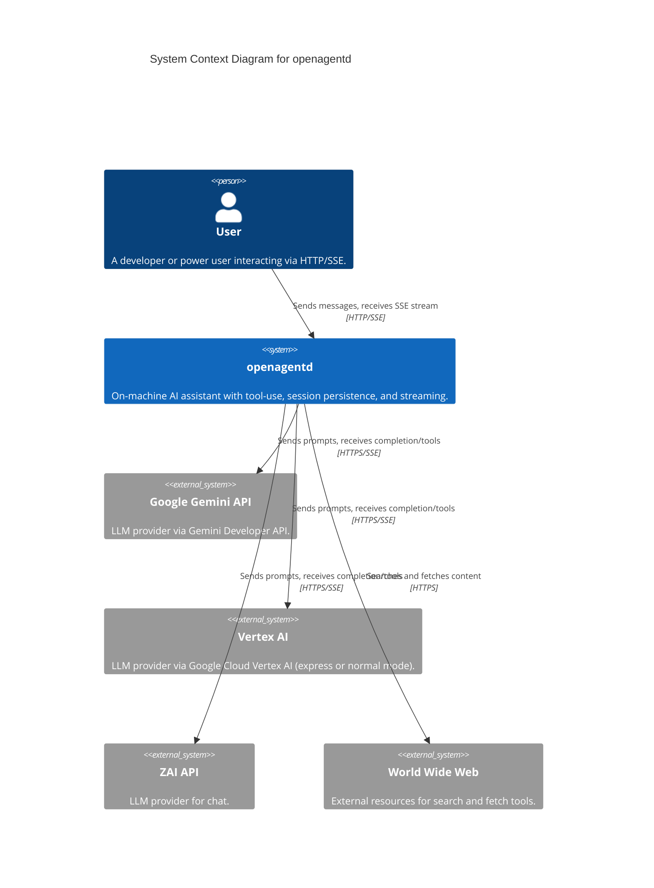
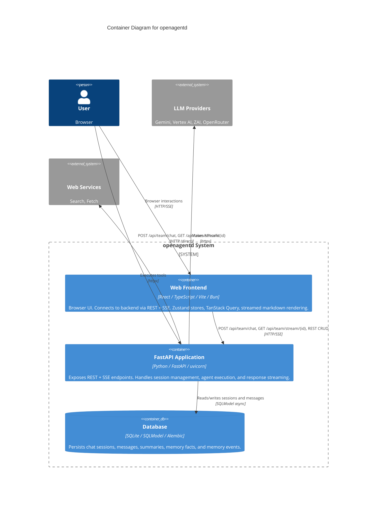
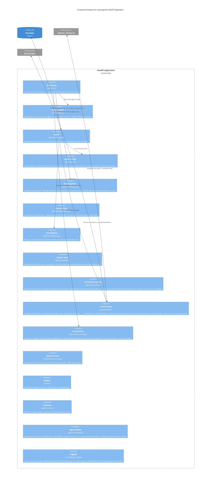
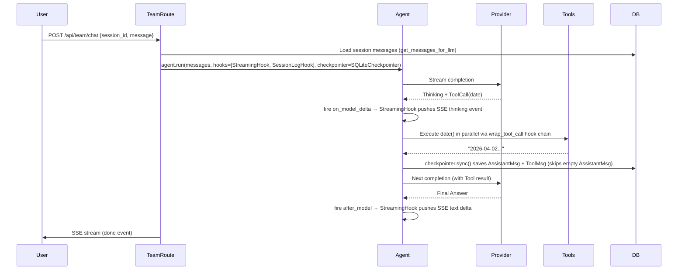

# openagentd Architecture (C4 Model)

This document provides a detailed technical overview of **openagentd** using the C4 model.

## 1. System Context Diagram (Level 1)
The highest level of abstraction, showing openagentd in its environment.



---

## 2. Container Diagram (Level 2)
Zooming into the openagentd system to see its internal containers.



---

## 3. Component Diagram (Level 3)
Zooming into the FastAPI Application container.



---

## 4. In-Memory SSE Streaming Architecture

### Overview

Every chat turn is backed by an in-memory state blob + asyncio fan-out queues (one per SSE client). This enables:
- **Fire-and-forget POST**: `POST /api/team/chat` returns 202 immediately, agent runs in background.
- **Mid-turn reconnect**: clients that disconnect and reconnect receive buffered content.
- **Multi-client streaming**: multiple tabs can watch the same session simultaneously (single-process).

### Data Layout (per session_id)

`memory_stream_store._turns[session_id]` holds a `_TurnState` instance that accumulates per-agent content, thinking, tool calls, statuses, and subscriber queues (see `app/services/memory_stream_store.py:36`).

`content` and `thinking` are **per-agent buckets** — replay re-emits each bucket with the correct `agent` field so mid-turn refreshes in a team session route tokens to the right agent's stream. `agent_statuses` is a latest-wins map so reconnecting clients immediately know which agents are `working` / `available` / `error`.

The state blob holds **only unpersisted live content**. After `checkpointer.sync()` writes assistant/tool rows to the DB, `stream_store.commit_agent_content(session_id, agent)` drops `content[agent]`, `thinking[agent]`, and every `tool_calls` entry whose `agent` field matches — otherwise a refresh between sync and the team-wide `mark_done()` would render the same block twice. Inbox messages are **not** stored in the blob — `_persist_inbox` writes the `HumanMessage` row before emitting the `inbox` SSE event, so replay is DB-backed.

### Turn Lifecycle

1. **`init_turn(session_id)`** — called synchronously in POST handler before spawning the background task. Creates `_TurnState`, sets `is_streaming=True`. Eliminates producer/consumer race condition.
2. **`push_event(session_id, envelope: StreamEnvelope)`** — called for every SSE event. The envelope is a typed Pydantic wrapper `{event: str, data: dict}` (see `app/services/stream_envelope.py`). Updates state blob and fans out `envelope.to_wire()` to all subscriber queues.
3. **`attach(session_id)`** — called by `GET /api/team/{session_id}/stream`. Subscribe-before-read two-phase protocol:
   - If `is_streaming=False` → return immediately (DB is authoritative).
   - Register a subscriber `asyncio.Queue` BEFORE replaying state (closes the gap window).
   - Replay accumulated state as synthetic events in order: `agent_status` (per agent) → `thinking` (per agent) → `tool_call` / `tool_start` / `tool_end` → `message` (per agent).
   - Yield live events from the queue until sentinel arrives.
4. **`mark_done(session_id)`** — sets `is_streaming=False`, pushes sentinel to all queues. Called after the turn completes.

### SSE Wire Format

Events are emitted by `sse_starlette` as:
```
event: <type>\n
data: <json>\n
\n
```

The `type` field inside the JSON body mirrors the SSE `event:` line. Both must be used.

### SSE Event Protocol

| Event | Direction | Payload fields |
|-------|-----------|---------------|
| `session` | server→client | `session_id` |
| `thinking` | server→client | `agent`, `text` |
| `message` | server→client | `agent`, `text` |
| `tool_call` | server→client | `agent`, `tool_call_id`, `name` — first delta, no args yet |
| `tool_start` | server→client | `agent`, `tool_call_id`, `name`, `arguments` — full args, execution beginning |
| `tool_end` | server→client | `agent`, `tool_call_id`, `name`, `result` — execution done |
| `usage` | server→client | `prompt_tokens`, `completion_tokens`, `total_tokens`, `cached_tokens`, `thoughts_tokens` |
| `rate_limit` | server→client | `retry_after`, `attempt`, `max_attempts` |
| `error` | server→client | `message` |
| `done` | server→client | — |
| `agent_status` | server→client | `agent`, `status` (`working`\|`available`\|`error`) — team only |
| `permission_asked` | server→client | `request_id`, `session_id`, `tool`, `patterns` — agent requesting approval before executing a tool |
| `permission_replied` | server→client | `request_id`, `session_id`, `reply` (`once`\|`always`\|`reject`) — permission request resolved |

### 3-Phase Tool Event Lifecycle

```
tool_call   ← fired from model streaming delta (first name appearance)
               → frontend shows spinner card immediately, no args
tool_start  ← fired from wrap_tool_call BEFORE execution (full args assembled)
               → frontend fills in args
tool_end    ← fired from wrap_tool_call AFTER execution
               → frontend marks done, shows result
```

`tool_call_id` is the LLM-assigned call ID (e.g. `call_f70e3244...`). It flows through all three events so the frontend can match them reliably, even when the same tool is called multiple times in parallel.

**Critical**: `tool_end` must use the `tool_call_id` registered at `tool_call` time (from the streaming delta), NOT from the assembled `ToolCall` buffer — the buffer may have wrong IDs when providers send parallel calls with the same `index`.

---

## 5. Agent Architecture

The agent engine lives entirely under `app/agent/`. For detailed documentation see [`documents/docs/agent/`](agent/):

| Doc | Covers |
|-----|--------|
| [`loop.md`](agent/loop.md) | Reasoning loop, retry logic, tool buffering, interrupt |
| [`hooks.md`](agent/hooks.md) | Hook lifecycle, built-in hooks, checkpointer, custom hooks |
| [`context.md`](agent/context.md) | RunContext, AgentState, message types, system prompt injection |
| [`tools.md`](agent/tools.md) | @tool decorator, Tool class, built-in tools, registration |
| [`teams.md`](agent/teams.md) | Multi-agent teams, mailbox, team_message peer messaging |
| [`summarization.md`](agent/summarization.md) | Rolling-window context compression |

### Request flow (sequence diagram)



---

## 6. Logging architecture

Two-tier logging (application-wide + per-session JSONL via `SessionLogHook`)
under `{OPENAGENTD_STATE_DIR}/logs/`. See [`logging.md`](./logging.md) for the
directory layout, event catalogue, configuration knobs, and console-output
format.

---

## 7. Security & trust model

openagentd is a **single-user, local-first** application. The security model assumes:

- **The operator is the user.** No authentication layer — the backend trusts localhost access.
- **The host is trusted.** The process has full access to the filesystem, shell, and network within configured sandbox boundaries.
- **LLM providers are semi-trusted.** API keys are sent to third-party providers (Gemini, etc.). Use local models if this is a concern.
- **Tool execution is powerful.** Agents can read/write files, run shell commands, and browse the web. `sandbox.workspace_root` limits file tool access, but shell commands run with the privileges of the backend process.

**Do not expose the backend to the public internet** without adding an authentication layer first.

| Layer | Protection |
|-------|-----------|
| Filesystem | `sandbox.workspace_root` restricts file tool access; paths outside are rejected. |
| Shell | Commands run as the backend process user — no additional sandboxing. |
| API keys | Stored in `.env` (not committed). Never logged or sent to the model. |
| Session data | Local SQLite only. No remote telemetry or data collection. |
| SSE streams | No auth on SSE endpoints — localhost access only by design. |

The following are **not** considered vulnerabilities given this trust model:

- An agent executing a destructive shell command (user authorized tool use)
- Reading files outside `workspace_root` via shell (shell has no sandbox)
- Prompt injection causing unexpected agent actions (inherent LLM limitation)
- Session data visible on the local filesystem (single-user design)
